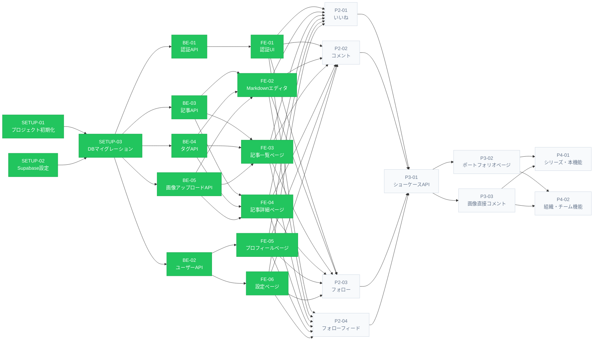

# 開発チケット一覧

## アローダイヤグラム

---

## 進捗ボード

> 各ClaudeCodeはチケットを着手する前にここを更新してください。
> ステータス: `pending` / `in_progress` / `done`
>
> **プロジェクトリーダー**: ClaudeCode-L（進捗・コスト・品質統制）
> 不明点はClaudeCode-Lに確認してから進めること。
>
> ### 自律進行ルール（各担当者に委譲）
>
> 各ClaudeCodeは以下の条件を自分で確認し、次のチケットへ自律的に進んでよい。
>
> 1. **依存チケットがすべて `done`** になっていること（アローダイヤグラム参照）
> 2. 着手前にこのボードの自分の行を `in_progress` + 担当名に更新すること
> 3. 完了時に `done` に更新し、成果物（ファイルパス・動作確認結果）をコメントに残すこと
> 4. **ブロッカー・判断迷い・仕様不明点** が発生した場合のみ ClaudeCode-L にエスカレーションすること
> 5. 自分のストリーム外のチケットには手を出さないこと（リーダー指示があれば別途対応）

| ID           | ステータス       | 担当          |
| ------------ | ----------- | ----------- |
| SETUP-01     | done        | ClaudeCode-1 |
| SETUP-02     | done        | ClaudeCode-2 |
| SETUP-03     | done        | ClaudeCode-1 |
| BE-01        | done        | ClaudeCode-1 |
| BE-02        | done        | ClaudeCode-4 |
| BE-03        | done        | ClaudeCode-2 |
| BE-04        | done        | ClaudeCode-3 |
| BE-05        | done        | ClaudeCode-3 |
| FE-01        | done        | ClaudeCode-1 |
| FE-02        | done        | ClaudeCode-2 |
| FE-03        | done        | ClaudeCode-2 |
| FE-04        | done        | ClaudeCode-2 |
| FE-05        | done        | ClaudeCode-4 |
| FE-06        | done        | ClaudeCode-4 |
| P2-01        | pending     | -           |
| P2-02        | pending     | -           |
| P2-03        | pending     | -           |
| P2-04        | pending     | -           |
| P3-01        | pending     | -           |
| P3-02        | pending     | -           |
| P3-03        | pending     | -           |
| P4-01        | pending     | -           |
| P4-02        | pending     | -           |

---

## ステップ0：基盤（全チケットの前提）

SETUP-01とSETUP-02は並行可能。SETUP-03はSETUP-02完了後に実施。

| ID           | 内容                          | 備考              |
| ------------ | --------------------------- | --------------- |
| **SETUP-01** | プロジェクト初期化（Next.js + NestJS） | SETUP-02と並行可    |
| **SETUP-02** | Supabase設定（DB・Auth・Storage） | SETUP-01と並行可    |
| **SETUP-03** | DBマイグレーション（Phase 1テーブル全件）   | SETUP-02完了後に実施 |

---

## ステップ1：Phase 1 MVP（3ストリーム並行可能）

SETUP完了後、以下3グループを同時に進められる。

### Stream A｜認証

| ID        | 内容                           |
| --------- | ---------------------------- |
| **BE-01** | 認証API（Supabase Auth連携・JWT検証） |
| **FE-01** | 認証UI（ログインページ・Google OAuth）   |

### Stream B｜記事

| ID        | 内容                            |
| --------- | ----------------------------- |
| **BE-03** | 記事API（CRUD・下書き/公開切り替え）        |
| **BE-04** | タグAPI（一覧・記事へのタグ付け）            |
| **BE-05** | 画像アップロードAPI（Supabase Storage） |
| **FE-02** | Markdownエディタ（ライブプレビュー・タグ入力）  |
| **FE-03** | 記事一覧ページ（カードレイアウト）             |
| **FE-04** | 記事詳細ページ（Markdownレンダリング）       |

### Stream C｜ユーザー

| ID        | 内容                    |
| --------- | --------------------- |
| **BE-02** | ユーザーAPI（プロフィール取得・更新）  |
| **FE-05** | ユーザープロフィールページ・マイページ   |
| **FE-06** | アカウント設定ページ            |

---

## ステップ2：Phase 2（4チケット並行可能）

Phase 1完了後、以下を同時に進められる。

| ID        | 内容                    |
| --------- | --------------------- |
| **P2-01** | いいね機能（BE + FE）        |
| **P2-02** | コメント機能（BE + FE）       |
| **P2-03** | フォロー/フォロワー機能（BE + FE） |
| **P2-04** | フォローフィード（BE + FE）     |

---

## ステップ3：Phase 3（順次 or 並行）

P3-01完了後にP3-02・P3-03を並行で進められる。

| ID        | 内容                   | 備考          |
| --------- | -------------------- | ----------- |
| **P3-01** | 作品投稿・ショーケースAPI（BE）   | 先行して実施      |
| **P3-02** | ポートフォリオページ（FE）       | P3-01の後、並行可 |
| **P3-03** | 画像直接コメント機能（BE + FE）  | P3-01の後、並行可 |

---

## ステップ4：Phase 4

| ID        | 内容       |
| --------- | -------- |
| **P4-01** | シリーズ・本機能 |
| **P4-02** | 組織・チーム機能 |
